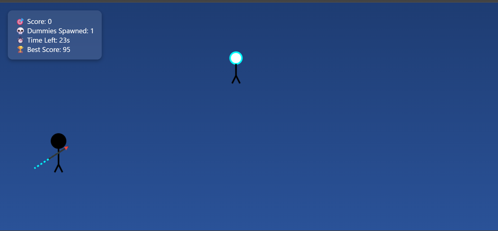

# 🏹 Archer Dummy Hit Game

A fun and interactive browser-based archery game where you shoot arrows at animated dummies. Includes smooth arrow physics, animated dummy reactions, and a dynamic scoring system.

---

## 🎮 Features

- 🏹 **Drag-and-release archery shooting**
- 🤖 **Random dummy spawning with falling animation**
- 🎯 **Scoring based on hit area (head, body, leg)**
- 📊 **Live score display with best score tracking**
- 🎬 **Start screen and end screen with Restart option**

---

## 🚀 Play Now

[🔗 Click here to play the game!](https://yourusername.github.io/archer-dummy-hit-game/)  
> *(Replace the link with your deployed version)*

---

## 🖼️ Screenshots

---

## 🛠️ Technologies Used

- HTML5 Canvas  
- JavaScript (Vanilla)  
- CSS3  

---

## 📈 Scoring System

| Hit Area | Points |
|----------|--------|
| Head     | 10     |
| Body     | 5      |
| Leg      | 2      |

> Your best score is saved in local storage and shown after each game.

---

## 📝 How to Play

1. Click **Start Game**
2. Drag and release your mouse to shoot arrows
3. Aim for different parts of the dummy to score
4. After all dummies are hit, view your score and restart anytime

---
